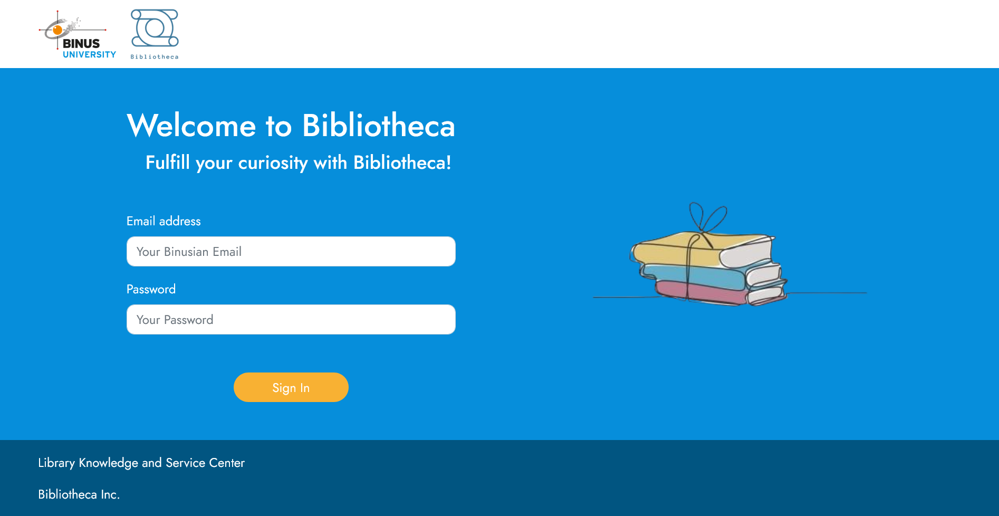
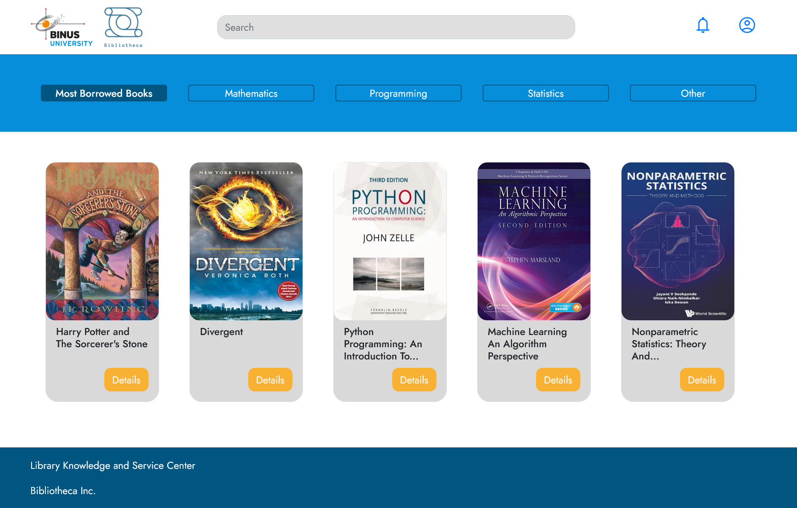
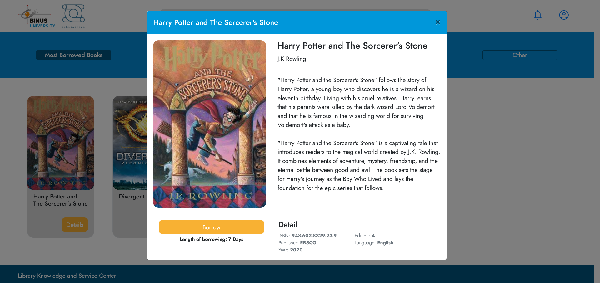
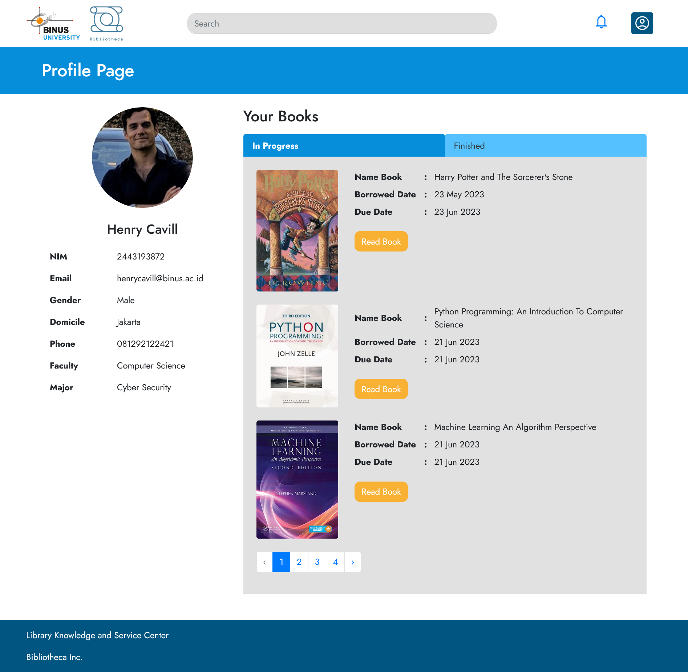
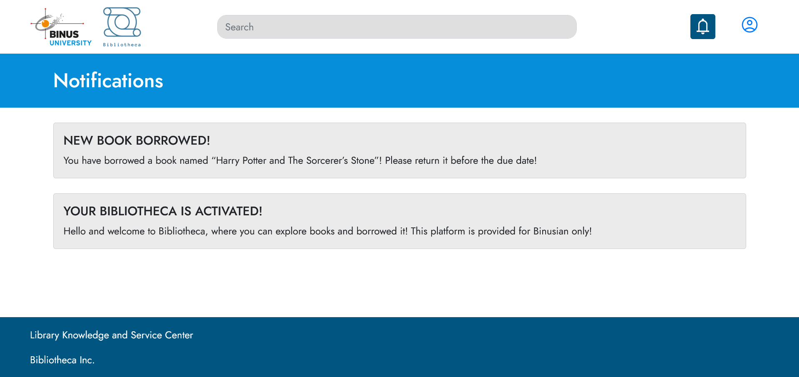
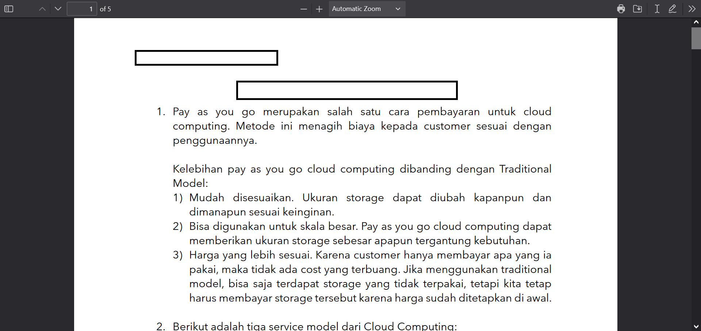

# Introducing Bibliotheca

A digital haven for book lovers and avid readers alike. Our platform offers a vast collection of e-books spanning various genres, ensuring there's something for everyone's literary taste. Let us take you on a virtual journey through the key features and captivating experience you can expect when exploring our e-book library.

1. Extensive E-Book Collection: Our website boasts an extensive and diverse collection of e-books, ranging from timeless classics to contemporary bestsellers, covering genres such as fiction, non-fiction, mystery, romance, science fiction, self-help, and more. With thousands of titles at your fingertips, you'll always find a captivating story or a valuable source of knowledge.

2. User-Friendly Interface: Navigating through our e-book library is a breeze, thanks to our user-friendly interface. The website is designed to be intuitive, ensuring a seamless browsing experience. You can easily search for specific titles, authors, or genres, and filter results based on various criteria to discover your next great read.

3. Easy Borrowing and Returning: Our e-book library operates on a borrowing system, simulating the experience of a physical library. Once you've found an e-book you'd like to read, you can borrow it for 7 days. After you've finished, simply return it to make room for others to enjoy or you can extend just by borrowing it again.

Whether you're an ardent bookworm or a casual reader, our e-book library website is designed to cater to your literary cravings. Immerse yourself in a digital realm of knowledge, imagination, and storytelling as you embark on an unforgettable reading experience. Happy reading!

## Login Page

## Home Page

## Detail Book Page

## Profile Page

## Notifications Page

## Read Book Page
